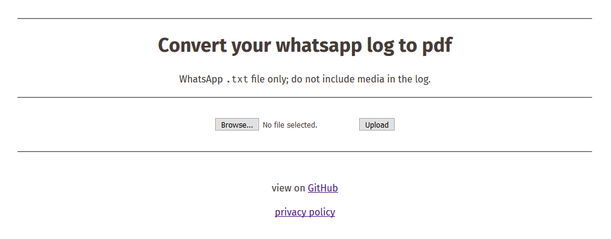

<p align="center">
  <!--img src="img.svg" width="250px"></img>
  <br-->
  <h1 align="center">wa2pdf</h1>
  <h4 align="center">Convert whatsapp logs to a presentable pdf report</h4>
  <p align="center">
    <a href="https://travis-ci.org/vankesteren/wa2pdf"></a>
  </p>
</p>
<br>

## Go to the [website](http://wa2pdf.ddns.net)
[](http://wa2pdf.ddns.net)
NB: It runs on a raspberry pi at home so be gentle and be patient; it's slow :)

## Prerequisites
### Windows
1. Install [MiKTeX](https://miktex.org/).
2. Make sure you have the font `DejaVu Sans` installed. You can get it from `dist/dejavu-sans` in this repository or from [dejavu-fonts/dejavu-fonts](https://github.com/dejavu-fonts/dejavu-fonts/releases).
3. Make sure you have [Node.js](https://nodejs.org/) installed.

### Linux
1. Install a TeX distribution with XeLaTeX `sudo apt-get install texlive-full`.
2. Install the dejavu font `sudo apt-get install ttf-dejavu`.
3. Make sure you have [Node.js](https://nodejs.org/) installed.


### Mac
_NB: I don't have a mac. If you want to contribute, try out whether these steps work and send me a PR to remove this line :)_
1. Install [MacTeX](http://www.tug.org/mactex/) (OSX).
2.Make sure you have the font `DejaVu Sans` installed. You can get it from `dist/dejavu-sans` in this repository or from [dejavu-fonts/dejavu-fonts](https://github.com/dejavu-fonts/dejavu-fonts/releases).
3. Make sure you have [Node.js](https://nodejs.org/) installed.

## How to use
### Command line interface
One step: `npm install -g vankesteren/wa2pdf`
The command line interface (see folder `./cli`) works like this:

`wa2pdf whatsapplog.txt -o prettylog.pdf`

Other usage information:
```
Usage: wa2pdf [options] <file>


Options:

  -o, --output <filename>  The output file (.pdf)
  -d, --debug              Print debug information
  -s, --silent             Do not open the converted pdf.
  -n, --noprogress         Do not show progress indicator.
  -h, --help               output usage information
```

### Server
Two steps:
1. clone this repository: `git clone https://github.com/vankesteren/wa2pdf.git`
2. Run `npm start` in the main directory of the repo.

The server will then start at port 8080. If you want a different port, use `npm start <portnumber>`. Direct your browser to the webpage. From there, you can upload WhatsApp log files to the server and download / save the pdf output.

## To do
Send me a pull request for (improvements on) any of these!
- ~~Create [unit tests](https://travis-ci.org/vankesteren/wa2pdf)~~
- Server interface:
    - send your whatsapp log via email?
    - ~~upload your log to a webpage?~~
- Template: Make the template pretty.
- ~~CLI: use [chalk](https://www.npmjs.com/package/chalk.) to style output~~
- Output: Optionally, calculate statistics etc for the report to be shown on top
    - total number of messages per person
    - most common words
    - other summary info

CLI dev: `npm link`
